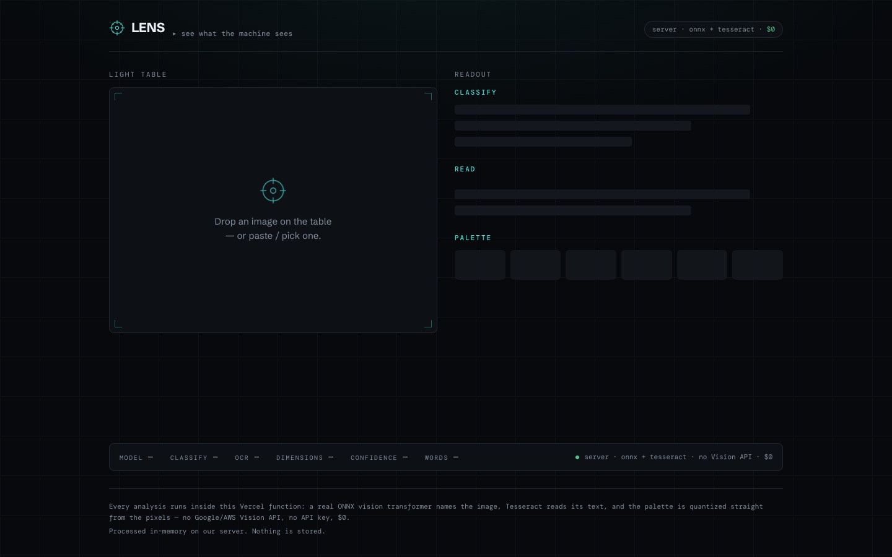

# Lens — see what the machine sees

> Drop an image → classification + OCR + palette, every model self-hosted. No Vision API. Next.js + ONNX + Tesseract.

**[Live demo](https://lens.ayoubalkak.com)** · part of [my portfolio](https://ayoubalkak.com)



Drop in an image and watch real vision models read it, all running **inside one Vercel
serverless function** — no third-party Vision API, no API key, **$0**:

- **Classify** — a real ONNX vision transformer (`Xenova/vit-base-patch16-224`, ImageNet-1k)
  running via `@huggingface/transformers` on CPU, returning a ranked top-k with confidence.
- **Read** — Tesseract OCR (`tesseract.js`) pulls out any text and draws boxes over the
  words it found, in place, on the image.
- **Palette** — the dominant colors, quantized straight from the real pixels (`sharp`).

A live **telemetry** strip proves it: model id, classify ms, OCR ms, dimensions, top-1
confidence, word count — and the honest fact that it all ran server-side for $0.

## Stack

Next.js 16 (App Router) · TypeScript · `@huggingface/transformers` (onnxruntime-node, CPU,
`q8`) · `tesseract.js` · `sharp` · Zustand · Framer Motion · Tailwind v4 · Schibsted Grotesk
+ DM Mono.

## Run locally

```bash
npm install                 # .npmrc skips onnxruntime's GPU-provider download (see below)
npm run fetch-model         # vendor the ~84MB q8 ONNX model into ./models (gitignored)
npm run fetch-tessdata      # vendor eng.traineddata.gz into ./tessdata (committed)
npm run dev                 # http://localhost:3000
```

`npm run build` runs both vendoring scripts then `next build`, so a fresh clone / CI builds
with no manual steps. Sanity-check the three engines without the UI:

```bash
node scripts/prove-inference.mjs   # classify a cat photo + OCR a text image + palette
```

## ⚠️ The size budget — the thing that can sink this project

Vercel Hobby serverless functions must be **< 250 MB unzipped**. We ship three native
runtimes (onnxruntime-node CPU, sharp/libvips, Tesseract wasm) plus the vendored model, and
land comfortably under the limit **only because of the recipe in `next.config.ts` +
`.npmrc`**. Do not change these casually:

1. **`.npmrc` → `onnxruntime-node-install=skip`.** Stops onnxruntime's postinstall from
   downloading the CUDA/TensorRT provider libs (hundreds of MB). Vercel has no GPU, so they
   are pure dead weight — and they blow the 250 MB limit when traced in. They don't appear
   on macOS, which is why this trap hides locally.
2. **`outputFileTracingIncludes`** lists the two onnxruntime **CPU** binaries *by name*
   (`libonnxruntime.so.1`, `onnxruntime_binding.node`) — **never** glob `linux/x64/*`, which
   would force-bundle the GPU providers. It also traces in `./models`, sharp + `@img`, and
   Tesseract's core + `./tessdata` (none are statically imported, so the tracer can't see
   them).
3. **`outputFileTracingExcludes`** drops non-linux onnxruntime binaries and any `*providers*`
   lib as a belt-and-suspenders guard.
4. **Verify on deploy #1** with `VERCEL_ANALYZE_BUILD_OUTPUT=1` and confirm `/api/analyze`
   is green (< 250 MB) **before** trusting the deploy.

(Estimate: ~84 MB model + ~34 MB onnxruntime CPU + ~16 MB sharp + ~12 MB Tesseract +
transformers ≈ **~150 MB**.)

## OCR on Vercel — the second landmine

Tesseract.js wants to download + cache its language data at runtime, but **Vercel's
filesystem is read-only except `/tmp`**. The fixes live in `lib/vision/ocr.ts`:

- **Vendor `eng.traineddata.gz`** into `./tessdata` (committed, ~1.9 MB) and point `langPath`
  at it with `gzip: true` — no cold-start network fetch.
- **`cachePath` MUST be `/tmp`** (the only writable dir).
- **One shared worker** cached on `globalThis` — a worker per request is slow.
- Trace `tesseract.js`, `tesseract.js-core`, and `./tessdata` into the function (next.config).

## SDK gotchas (verified against the installed versions)

- `@huggingface/transformers` v4 uses **`top_k`** (snake_case). `topk` silently returns only
  one label.
- Decode the upload with **`RawImage.fromBlob(new Blob([bytes]))`**; the pipeline runs the
  model's own preprocessor.
- `tesseract.js` v6 **removed the flat `data.words`** — per-word geometry now lives in the
  block tree (`data.blocks[] → paragraphs[] → lines[] → words[]`), each with
  `{text, confidence, bbox:{x0,y0,x1,y1}}`. We flatten it and keep only confident words.
- We never show OCR text we don't believe: words must clear a confidence + length filter,
  and a lone mid-confidence token (classic noise on a textureless photo) is dropped.

## Deploy

1. Commit. `.gitignore` excludes `/models` (the 84 MB weight exceeds GitHub's 100 MB/file
   limit — it's re-fetched at build); `./tessdata/eng.traineddata.gz` **is** committed.
   No secrets in this repo by design.
2. Push to GitHub and import to Vercel. The build runs the vendoring scripts +
   `next build` automatically.
3. Deploy with `--build-env VERCEL_ANALYZE_BUILD_OUTPUT=1` and **confirm `/api/analyze` <
   250 MB**. Smoke-test the live URL with a photo that has text.

### Environment

- `MODEL_ID` *(optional)* — override the classifier (must ship `onnx/model_quantized.onnx`
  + `preprocessor_config.json`; update the floor in `scripts/fetch-model.mjs` if needed).
- No secret keys. That's the whole point.

## Privacy

Images are processed **in-memory** on the server and **not stored** (v1 is stateless). The
shareable artifact is the downloaded analysis card / results JSON.
